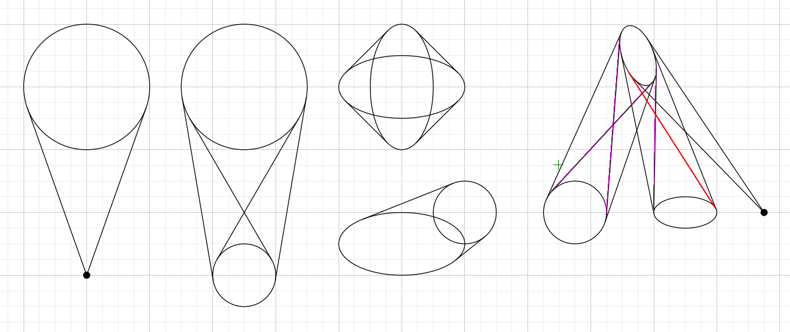
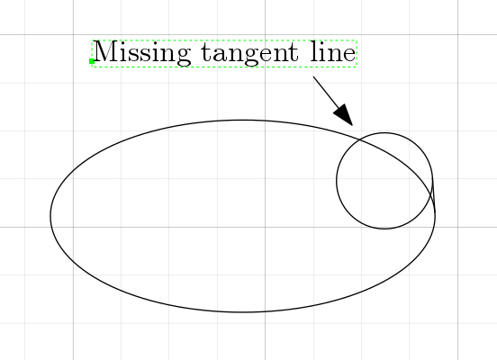

# tangentlines

Draws tangent line segments between ellipses, circles and markers

## Download and Installation

Download [tangentlines.lua!](tangentlines.lua) and copy to ~/.ipe/ipelets/ (or to some other directory for ipelets)

## Usage

* Select at least two ellipses, circles and/or markers, then click "Ipelets->Tangent Lines" or use the short cut Alt-t.
* Tangent lines will be drawn from the primary selection to all other selected objects.
* To change the primary selection, go into selection mode (hit "s" on the keyboard) then while holding the Shift key double click on the object which you would like as your primary selection.
* If there are any intersecting tangent line segments, they will remain selected so that you can easily delete them withs the "Delete" key.

## Author

* Andrew Martchenko

## Bugs

1. Fails to draw tangent lines when a small ellipse is intersecting the pointy end of a large ellipse as in the example below.

